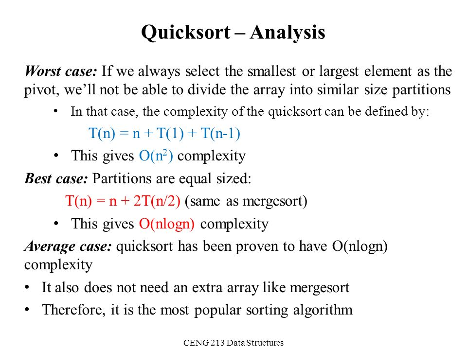

 # Quick Sort

_Quick Sort_ is a Divide and Conquer Algorithm that exploits the fact that arrays of 0 or 1 elements are always sorted.

- An array with 0 elements - i.e.: `[]` - has nothing to sort;
- An array with 1 element - i.e.: `[2]` - is already sorted;

### Overview

Quick sort works by selecting one element in the array– a "pivot"– and comparing each element to that partition.

On selecting a pivot– also referred to as the **partition index**– Quick Sort then moves the elements such that all elements **less than** the pivot come before all elements **greater than**. This creates a natural division in the array. This process is then repeated using recursion on the left and right sides, referred to as "partitions".

There are various ways of choosing the pivot, namely:

- Choose the **first** element
- Choose the **last** element
- Pick a **random** element
- "Median of 3"

> An example of using the last element as the pivot:

> An example of using the first element as the pivot:

Let's take a look at this, visually:

[Quick Sort](https://opendsa-server.cs.vt.edu/embed/quicksortAV)

[Hungarian Saxon Dancing!](https://www.youtube.com/watch?v=ywWBy6J5gz8&list=PLuE79vNc5Wi6q34LsQcaJ7ISQ8uOyMaL_&index=4)

[Extra Video of Quick Sort Explained](https://youtu.be/SLauY6PpjW4?t=10)

### Implementation

To implement the sort, it's helpful to have:

1. A **partition** helper method.
2. The `quickSort()` function, used recursively on the partitions.

### Part 1: Partition Helper

In order to implement quick sort, it's useful to first implement a function responsible for arranging elements in an array on either side of a pivot. Given an array, this helper function should:

- Designate an element as the pivot.
- Rearrange elements in the array so that **all values less than the pivot** are moved to the left of **all vlaues greater than the pivot**. 
- When complete, the helper should return the **index of the pivot**

Note: The order of elements on either side of the pivot doesn't matter, and the helper should do this in place, that is, it should not create a new array.

### Pseudocode 

Write a function `partition()` that accepts 3 arguments:
an array, a start index, and an end index (default values: start = 0, end = array.length-1).

- Grab the pivot.
- Store the current pivot index in a variable `swapIndex` (this will keep track of where the pivot should end up).
- Loop through the array from start to end.
  - If the pivot is greater than the current element, increment the pivot index variable and then swap the current element with the element in the pivot index.
- Outside of the loop swap the starting element(i.e the pivot) with the pivot index.
- Return the `swapIndex`.

### Part 2: quickSort()

Write a function `quickSort()` that accepts 3 arguments: an array, start index, and an end index( default values: start = 0, end = array.length-1);

- Call the partition helper on the array that's been passed in
- When the helper returns the updated pivot index, **recursively** call `quickSort()` on the left and on the right subarray

### Big O Complexity

Quick Sort complexity depends on the pivot, which means picking your pivot is very important.

- Ideally, the pivot should be chosen so that it's roughly the median value in the data set you're sorting.
- For simplicity, we'll always choose the pivot to be the first element or the last.

#### Best Case

If we assume perfect partitioning, we get exact halves every time. The "halves" probably won't be precisely equal, but if we choose the pivot well, they should be pretty close.

In this case, the number of times we can break it in half will be the base-2 logarithm of the number of inputs. For example, given 128 inputs, we get partition sizes of 64, 32, 16, 8, 4, 2, and 1. That's 7 levels of partitioning (and yes log2(128) = 7).

So, we have O(logN) partitioning "levels", or height of the stack frames and each level has to visit all N inputs. So, log(N) levels times N operations per level gives us **O(N log N)** overall complexity.
In the best case scenario, the entire algorithm will take O(N) * O(logN) which is equal to **O(N log N)**

#### Worst Case

The worst case is if we pick a pivot that's actually the smallest or largest element in the input. In this case, we do an O(N) partitioning level, but instead of getting two halves of equal size, we've ended up with one partition of one element, and one partition of N elements. If that happens for every level of partitioning, we obviously end up doing O(N),instead of O(logn) partitioning levels before even partition is down to one element.

This gives the technically correct big-O complexity for Quick Sort. Since we have O(N) levels of partitioning, and each level requires O(N) steps, we end up with O(N * N) (i.e., **O(N2)** complexity.

## 

